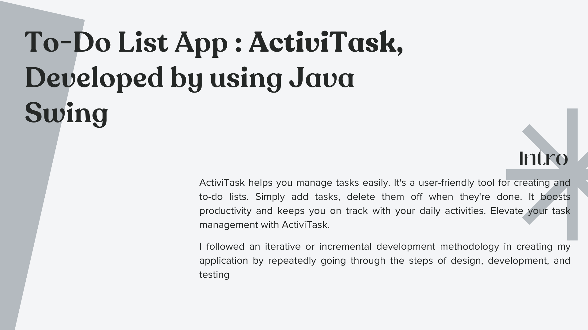
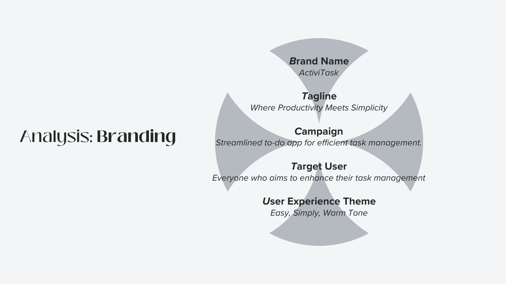
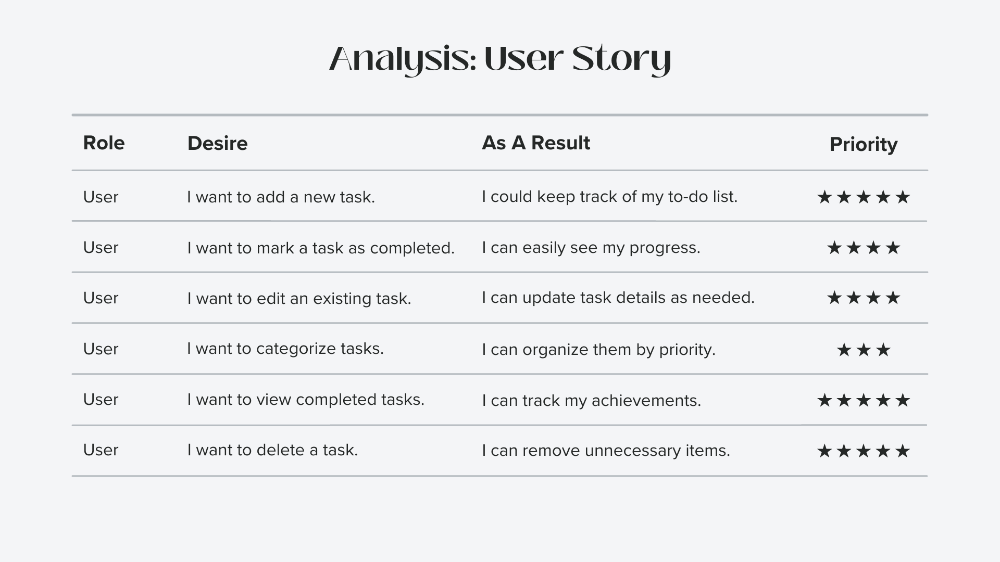
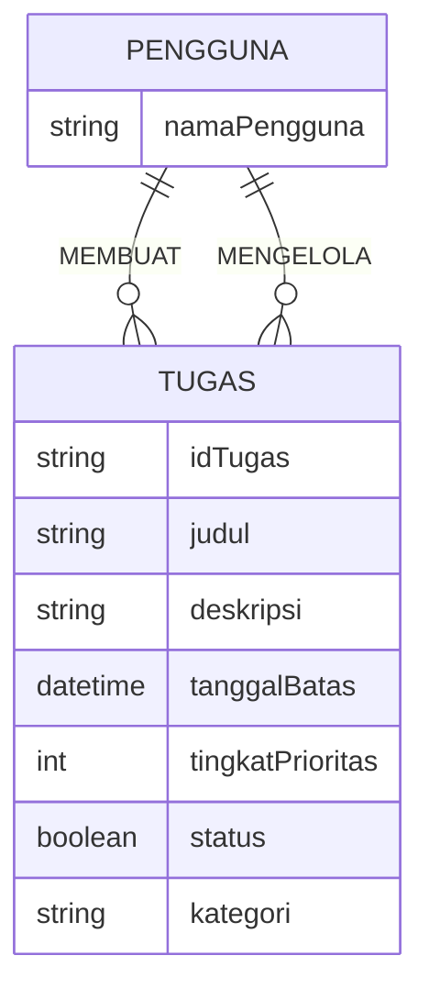
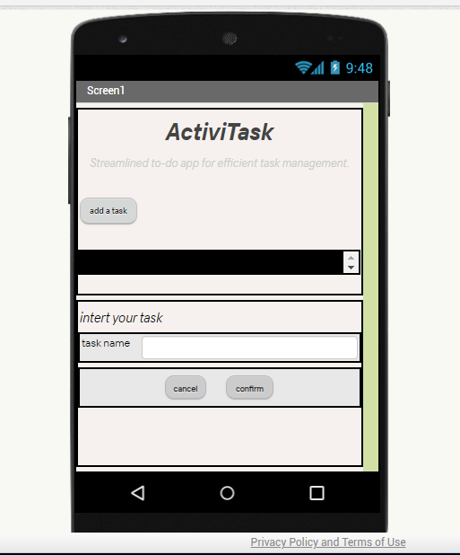

# INTRO 
<!DOCTYPE html>
<html lang="en">

<head>
    <meta charset="UTF-8">
    <meta name="viewport" content="width=device-width, initial-scale=1.0">
    <meta http-equiv="X-UA-Compatible" content="ie=edge">
</head>

<body>
    
</body>

</html>

# 1.1. Latar Belakang
Saya memutuskan untuk menciptakan aplikasi ini karena saya menyadari betapa pentingnya manajemen tugas dalam kehidupan sehari-hari. Seringkali, kita memiliki banyak hal yang harus dilakukan dan terkadang sulit untuk mengingat semuanya. Saya ingin menciptakan alat yang sederhana namun efektif untuk membantu orang mengatur dan menyelesaikan tugas-tugas mereka dengan lebih efisien.

Saya juga menyadari bahwa kebanyakan aplikasi manajemen tugas cenderung kompleks dan sulit digunakan. Oleh karena itu, saya ingin menciptakan antarmuka yang ramah pengguna dan mudah dipahami, sehingga siapa pun dapat dengan cepat menggunakannya tanpa hambatan. Saya percaya bahwa dengan bantuan ActiviTask, orang dapat merasa lebih terorganisir dan produktif dalam aktivitas sehari-hari mereka.

Terlebih lagi, saya selalu tertarik dalam pengembangan perangkat lunak dan teknologi. Saya melihat penciptaan aplikasi ini sebagai kesempatan untuk menggabungkan minat saya dalam pengembangan perangkat lunak dengan keinginan untuk menciptakan solusi yang bermanfaat bagi banyak orang.

Melalui pengembangan berkelanjutan dan proses iteratif, saya berharap ActiviTask dapat menjadi alat yang berguna dan dapat diandalkan bagi pengguna di seluruh dunia. Saya bersemangat untuk terus meningkatkan dan mengembangkan aplikasi ini agar dapat memenuhi kebutuhan dan harapan pengguna dengan lebih baik.

# 1.2. Deskripsi Teknologi Informasi
ActiviTask adalah solusi canggih untuk mengelola tugas-tugas Anda dengan efisien. Dengan antarmuka pengguna yang ramah dan intuitif, aplikasi ini memungkinkan Anda untuk dengan mudah membuat dan mengelola daftar tugas Anda. Dari menambahkan tugas baru hingga menandai yang sudah selesai, ActiviTask memastikan Anda tetap terorganisir dan produktif dalam setiap aktivitas harian Anda.

Dalam pengembangannya, saya menerapkan pendekatan iteratif dan inkremental. Awalnya, desain UI/UX dibuat dengan menggunakan MIT App Inventor untuk memastikan kenyamanan dan kemudahan penggunaan. Selanjutnya, aplikasi ini akan diterjemahkan ke dalam bahasa pemrograman Java dengan menggunakan platform Java Swing, memberikan fungsionalitas yang lebih kuat dan komprehensif.

Dengan kombinasi desain yang ramah pengguna dari MIT App Inventor dan fungsionalitas yang kuat dari Java Swing, ActiviTask bertujuan untuk memberikan pengalaman pengelolaan tugas yang luar biasa. Jadikan setiap hari Anda lebih terorganisir dan produktif dengan ActiviTask.

# 1.3. Branding
<!DOCTYPE html>
<html lang="en">

<head>
    <meta charset="UTF-8">
    <meta name="viewport" content="width=device-width, initial-scale=1.0">
    <meta http-equiv="X-UA-Compatible" content="ie=edge">
</head>

<body>
    
</body>

</html>

# 2. User Story 
<!DOCTYPE html>
<html lang="en">

<head>
    <meta charset="UTF-8">
    <meta name="viewport" content="width=device-width, initial-scale=1.0">
    <meta http-equiv="X-UA-Compatible" content="ie=edge">
</head>

<body>
    
</body>

</html>
Ini beberapa User Story tambahan dari perspektif lain :

Sebagai | Saya ingin | Sehingga | Level Prioritas
---|---|---|---
Pemilik Bisnis | Memantau tugas terkait proyek-proyek |	Memastikan semuanya berjalan lancar | ⭐⭐⭐⭐
Pemilik Bisnis | Melihat tugas dengan tenggat waktu mendekati |	Mengantisipasi risiko keterlambatan | ⭐⭐⭐
Pelajar | Mengelompokkan tugas berdasarkan mata pelajaran atau deadline |	Memudahkan perencanaan studi | ⭐⭐⭐⭐
Pelajar |Menetapkan prioritas pada tugas-tugas | Fokus pada yang paling penting | ⭐⭐⭐
Orang Tua | Memantau dan membimbing anak-anak dalam menyelesaikan tugas-tugas sekolah | Memastikan anak-anak dapat menyelesaikan tugas dengan baik | ⭐⭐⭐⭐
Orang Tua | Menetapkan pengingat untuk tugas-tugas atau kegiatan ekstrakurikuler anak-anak | Memastikan anak-anak tidak melewatkan kegiatan penting | ⭐⭐⭐
Olahragawan | Menyusun program latihan berdasarkan fokus dan tujuan latihan |	Mencapai performa olahraga yang lebih baik | ⭐⭐⭐⭐
Olahragawan | Memantau jadwal latihan dan kompetisi | Memastikan kesiapan fisik dan mental optimal | ⭐⭐⭐⭐
Traveler | Merencanakan rencana perjalanan | Mengatur jadwal dan aktivitas selama perjalanan | ⭐⭐⭐⭐
Guru atau Pendidik | Membuat daftar tugas untuk siswa | Memudahkan siswa dalam menyelesaikan tugas-tugas | ⭐⭐⭐⭐
Manajer Proyek | Memantau proyek dan tugas tim | Memastikan proyek selesai sesuai jadwal | ⭐⭐⭐⭐
Pencari Kerja | Menyusun daftar tugas pencarian kerja | Meningkatkan efisiensi dalam mencari pekerjaan | ⭐⭐⭐
Blogger atau Penulis | Mengelola jadwal posting dan ide konten | Konsisten dalam mempublikasikan konten | ⭐⭐⭐
Pemilik Kafe atau Restoran | Mengelola tugas sehari-hari dalam operasi bisnis | Memastikan operasi berjalan lancar | ⭐⭐⭐⭐
Anggota Organisasi Sosial | Mengelola proyek dan tugas sukarelawan | Menyediakan bantuan yang lebih efektif kepada komunitas | ⭐⭐⭐⭐
Pemburu Diskon atau Penawar | Menyusun daftar belanjaan dan menetapkan anggaran | Maksimalkan penghematan saat berbelanja | ⭐⭐⭐
Pekerja Seni atau Desainer | Mengatur jadwal proyek dan presentasi klien | Memastikan proyek diserahkan sesuai tenggat waktu | ⭐⭐⭐⭐

## 3. Struktur Data

## 4. Arsitektur Sistem
Desain UI/UX - MIT App Inventor --> Penerjemahan ke Java Swing --> Aplikasi ActiviTask

Penjelasan:

- Desain UI/UX - MIT App Inventor: Proses awal pengembangan melibatkan pembuatan desain antarmuka pengguna yang ramah dan intuitif menggunakan MIT App Inventor. Ini memastikan kenyamanan dan kemudahan penggunaan aplikasi.

- Penerjemahan ke Java Swing: Setelah desain UI/UX selesai, aplikasi akan diterjemahkan ke bahasa pemrograman Java menggunakan platform Java Swing. Hal ini memberikan fungsionalitas yang lebih kuat dan komprehensif kepada ActiviTask.

- Aplikasi ActiviTask: Merupakan hasil akhir dari pengembangan, yang memungkinkan pengguna untuk dengan mudah membuat dan mengelola daftar tugas. Pengguna dapat menambahkan tugas baru, mengedit, menghapus, dan menandai sebagai selesai.

## 5. Teknologi, Library, dan Framework
Teknologi:
    - MIT App Inventor
    - Java
    - PostgreSQL

Library:
    - Java Swing

Framework:
    - Tidak diperlukan dalam konteks MIT App Inventor dan Java Swing

## 6. Desain User Experience dan User Interface
<!DOCTYPE html>
<html lang="en">

<head>
    <meta charset="UTF-8">
    <meta name="viewport" content="width=device-width, initial-scale=1.0">
    <meta http-equiv="X-UA-Compatible" content="ie=edge">
</head>

<body>
    
</body>

</html>
